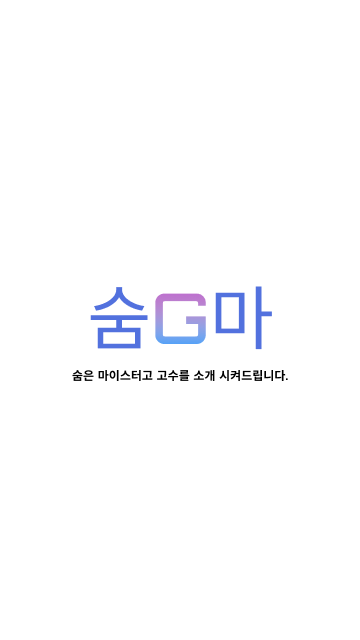
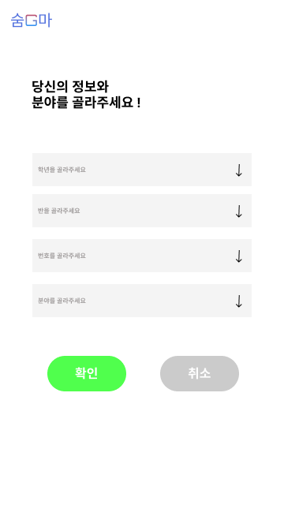
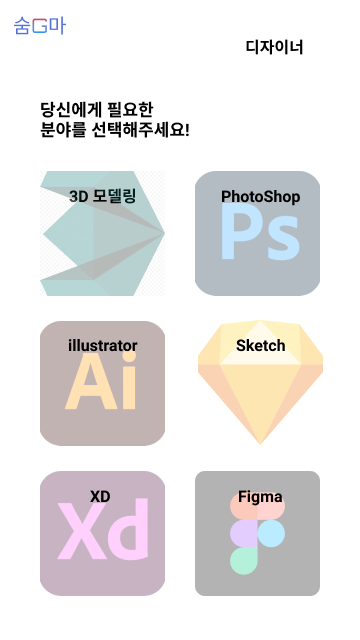

# Project
## [숨G마](https://github.com/Job-Tang/gsm-soomgo-application)

교내에 나에게 도움을 줄 수 있는 다양하고 수 많은 사람들을 매칭해주는 서비스를 개발했습니다. 이와 유사한 서비스로 **soomgo**가 있지만 교내에 개발공부를 하는 학생들을 타겟으로 개발했기 때문에 개발에 있어서 도움을 요구하는 분야의 고수에게 매칭을 시켜주는 기능을 중점으로 생각했습니다.

저는 3번째 사진의 분야 선택을 **리사이클러뷰**를 사용해서 개발을 했고 사진은 **Glide**라이브러리를 사용해서 개발했습니다. 또한 **Github**를 통해 협업을 관리하는 역할을 했습니다.

## [CAMAP](https://github.com/Hoseong-Ryu/JavaAppProject) 

여행을 다니는 도중 사진을 찍고 제목과 내용만 추가하면 언제든지 자신이 예전에 갔었던 여행을 회상할 때 언제 어디를 갔는지를 이 앱을 통해 한눈에 알아보고 기억할 수 있습니다. 그리고 더욱 쉽게 관리하기 위해 메뉴 버튼으로 여행별로 보고 관리할 수 있습니다. 또한 구글맵에 사진을 찍은 장소가 나오면서 어떤 장소에서 찍었는지 알 수 있습니다.

프로젝트를 진행하면서 **github**를 통한 협업을 하는 방법을 알았습니다. **구글맵 연동**을 하면서 API키를 가져올 때 어려움을 느꼇지만 결국 해냈고 아쉬운 점은 파일분리가 되어있지 않아서 협업하는데 있어서 힘들었습니다.

## [스터디카페 키오스크](https://github.com/Hoseong-Ryu/ConsoleApp1/tree/master/Project_1_3/Project) 

스터디카페뿐만 아니라 어디를 가든 키오스크를 쓰는 추세인데 그 키오스크를 밴치마킹하여 `C#`으로 만든 윈폼입니다.

**DB**를 두번째로 사용해 보았지만 잘 적응이 되지 않았고 **DB** 설계를 할 때 어려움을 느꼈고 폼을 여러개 사용하고 버튼마다 이벤트를 주다보니 수업시간에 한것과는 달라서 어려웠다. 프로젝트를 만들고 난 후 **MSSQL**에 대해 알게된 계기가 됐다.

## [GSM-GUIDE](https://github.com/Hoseong-Ryu/Gsm-festival)

**React.JS**와 **Node.JS**로 개발이 되었으며 광주소프트웨어마이스터고등학교의 신입생들을 위한 가이드 서비스 입니다. 

**Node.JS**로 백엔드를 처음해본 프로젝트이며 **로그인**,**회원가입**을 구현했습니다. **DB**는 **MySQL**을 사용하여 개발하였습니다. *app.js* 파일 하나로 개발을 했기 때문에 만약 **GitHub**를 통해 협업을 했다면 많은 충돌로 인해 진행이 힘들었을 프로젝트 입니다.

